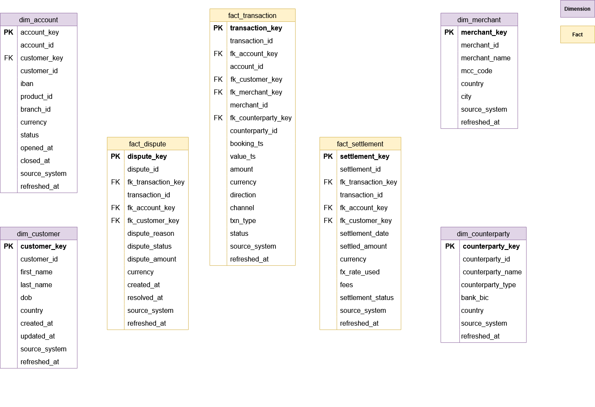

# End-to-end Azure Data Engineering - Banking Transaction Pipeline

## Introduction

This end-to-end data engineering project simulates a multi-bank environment and implements a complete Medallion Architecture (Bronze → Silver → Gold) on Azure.

The platform ingests data from:

- Two simulated core banking systems (Bank A & Bank B – Azure SQL Databases)
- Flat files (settlements, disputes, MCC codes)
- An external FX Rates API

It orchestrates ingestion using Azure Data Factory, stores data in Azure Data Lake Storage Gen2 (hierarchical namespace enabled), transforms data with Azure Databricks (PySpark), and implements governance, auditing, and SCD2 modeling in the Gold layer.

## Architecture

## Technology Used

### Cloud Platform
- Microsoft Azure

### Services Used
- Azure Data Factory (ADF)
- Azure Data Lake Storage Gen2 (Hierarchical Namespace enabled)
- Azure Databricks
- Azure SQL Database
- Azure Key Vault

### Languages & Frameworks
- Python (data generators, API extract)
- PySpark (transformations)
- SQL (DDL, transformations)
- Delta Lake

## Data Used

The data used in this project simulates a realistic retail banking environment with two independent core banking systems (Bank A and Bank B). Each bank manages customers, accounts, products, branches, merchants, counterparties, and transactional activity.

Customer behavior is intentionally modeled to reflect real-world patterns: salary inflows, rent payments, card purchases, ATM withdrawals, fees, interest accrual, and varying transaction volumes. A small percentage of transactions generate disputes, and settlements are produced with realistic clearing delays and processing fees.

In addition to core banking data, the platform ingests external flat files (MCC codes, settlements, disputes) and an FX rates API feed, reproducing a typical financial institution scenario where operational systems, external processors, and market data providers must be unified into a single analytical platform.

## Data Model

## Project Implementation

This project builds a complete data pipeline using the Medallion Architecture (Bronze → Silver → Gold). Data is first ingested in its raw form into the Bronze layer, then cleaned and standardized in Silver, and finally modeled into analytical tables in Gold.

Azure Data Factory pipelines are metadata-driven and run in parallel when possible instead of sequentially. Retry policies are configured in case of temporary failures. Each pipeline execution writes information into custom audit tables, storing run IDs, load types (full or incremental), watermark values, and statuses. This makes it possible to track what was loaded and when.

Data is stored in ADLS Gen2 with hierarchical namespace enabled, allowing structured folder organization similar to a file system. Sensitive credentials such as database passwords and access tokens are stored in Azure Key Vault and referenced securely by pipelines.

In the transformation layer, schemas from Bank A and Bank B are aligned using a common structure (CDM-style harmonization). The Gold layer implements Slowly Changing Dimension Type 2 (SCD2) logic to keep historical changes, along with an is_active flag to easily identify the current version of a record. Invalid or malformed records are redirected to a quarantine flow instead of stopping the pipeline.

## Future Improvements

This project could be extended by migrating from Hive Metastore to Unity Catalog to introduce centralized governance and access control. A full CI/CD setup for Azure Data Factory and Databricks would allow automated deployments across environments.

Performance could be improved through additional Delta Lake optimizations such as Z-Ordering. A monitoring dashboard (e.g., Power BI) built on top of the audit tables could provide visibility into pipeline runs and load activity. Finally, a structured data quality framework could be added to formalize validation checks beyond the existing quarantine flow.

## Scripts for Project

[Bronze Ingestion Pipeline](2_bronze_ingestion_adf/pipelines/pl_ingestion_bronze.json)

[Silver Pipeline](2_bronze_ingestion_adf/pipelines/pl_bronze_to_silver.json)

[Gold Pipeline](2_bronze_ingestion_adf/pipelines/pl_silver_to_gold.json)

[Master Pipeline](2_bronze_ingestion_adf/pipelines/pl_master.json)

---